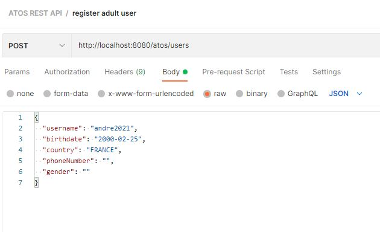
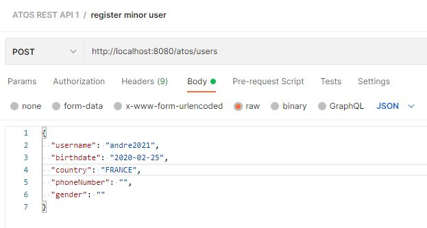
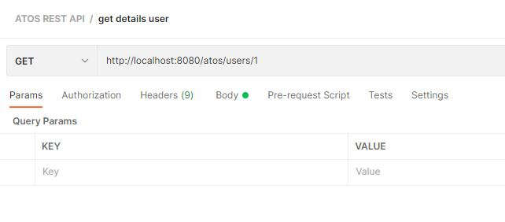
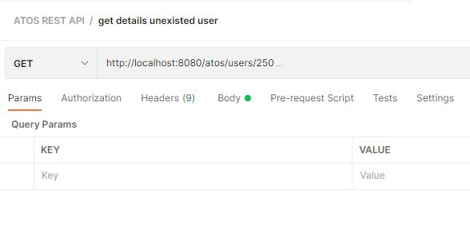

# HOW TO RUN THE APP
 - Locate deploy.sh file at the root of the project
 - double-click on deploy.sh file
 - wait until the app builds and launches
 
 #HOW TO USE THE APP
  open Postman and run the following requests
  
  Here are some requests
  
  
   - register an adult user
   POST http://localhost:8080/atos/users
   {
     "username": "andre2021",
     "birthdate": "2000-02-25",
     "country": "FRANCE",
     "phoneNumber": "",
     "gender": ""
   }
   
   
  - register a minor user
  POST http://localhost:8080/atos/users
  {
    "username": "andre2021",
    "birthdate": "2020-02-25",
    "country": "FRANCE",
    "phoneNumber": "",
    "gender": ""
  }
  
  
  - get details of existing user
    GET http://localhost:8080/atos/users/1
    
   
  - get details of non-existing user
    GET http://localhost:8080/atos/users/9999
  
  
  
 
